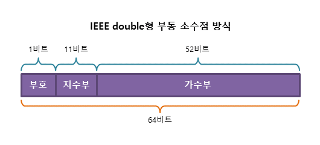

# 실수의 표현
컴퓨터의 정수 계산은 수의 범위만 잘 설정해주면 오류가 날 가능성이 거의 없다. 하지만 소수가 포함된 실수계산은 조금 다르다. 컴퓨터에서 실수를 표현하는 방법은 크게 '고정 소수점 방식', '부동 소수점 방식'이 존재한다.

## 고정 소수점 방식
실수는 보통 정수부와 실수부로 나뉜다. 32비트로 실수를 표현한다고 하면 1비트는 부호비트 15비트는 정수부, 16비트는 소수부로 나누어 표현하는 방식이다. 하지만 이 방식은 표현할 수 있는 수의 범위가 매우 작다.

## 부동 소수점 방식
실수를 가수부와 지수부로 나누어 표현하는 방식이다. 32비트 기준으로 1비트는 부호비트 8비트는 지수부, 23비트는 가수부로 표현한다. 이는 IEEE 754 표준에 따른 부동 소수점 표현방식이다.

부동소수점 공식: $(−1)^S\times M\times 2^E$
* S: 부호부
* M: 가수부
* S: 지수부

## 실수 표현시 오류가 발생하는 이유
10진수로 표현된 소수를 2진수로 표현할 때 가수부가 표현할 수 있는 비트수를 넘어가게 되면 손실되는 부분이 발생한다. 이럴 때 오차가 발생하고 10진수로 표현할 때는 무한소수가 아니어도 2진수로 표현하면 무한소수로 표현될 수 있기 때문에 오차가 발생할 수 있다.

## Java에서 부동소수점을 오차없이 다루는 방법
Java에서 실수를 다룰 때 보통 float과 double을 다룬다. 하지만 돈계산과 같은 정확한 계산을 필요로한다면 BigDecimal을 사용해야한다. BigDecimal은 속도가 느리다는 단점이 있지만 정확한 소수 계산을 위해서는 필수적으로 사용해야한다.