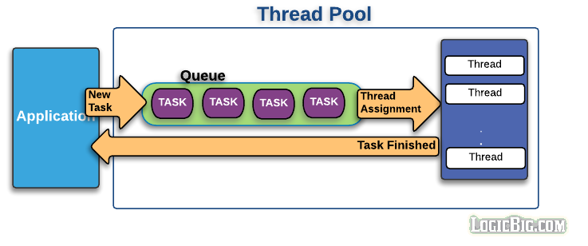

# 쓰레드의 생성 비용
## 단일 쓰레드의 생성비용
Java8에서는 스택의 깊이가 최대로 늘어났을 때 1MB까지 할당된다. 그렇지만 최소한 16KB의 메모리를 할당하므로 무작정 쓰레드를 많이 생성하게 되면 JVM 메모리 공간을 많이 점유할 수 있다.

## 쓰레드 풀
쓰레드를 생성하고 수거하는 과정은 매우 소모적이다. 스택과 레지스터 공간도 할당해야하고 쓰레드 간의 Context Switching은 소모적인 작업니다. 즉 쓰레드를 무차별적으로 생성하게 되면 시스템의 성능 저하로 이어진다. 이를 해결하기 위해 쓰레드 풀이 등장하였다. 

쓰레드 풀은 작업처리에 사용되는 쓰레드를 제한된 개수만큼 정해놓고 작업 큐에 들어오는 작업들을 하나씩 쓰레드가 맡아 처리한다. 작업 요청이 폭증되어도 쓰레드의 전체개수가 늘어나지 않으므로 시스템 성능히 급격하게 저하되지 않는다.
### 쓰레드 풀의 단점
쓰레드 풀에 작업들이 할당 되었고 먼저 작업을 끝낸 쓰레드는 더 오래걸리는 작업을 수행중인 쓰레드를 기다리는 동안 멈춰있다. 이를 해결하기 위해서 Java7에서는 'Fork Join Thread Pool'이라는 개선된 쓰레드 풀이 등장한다.

## 톰캣에서 쓰레드를 많이 사용하는 이유